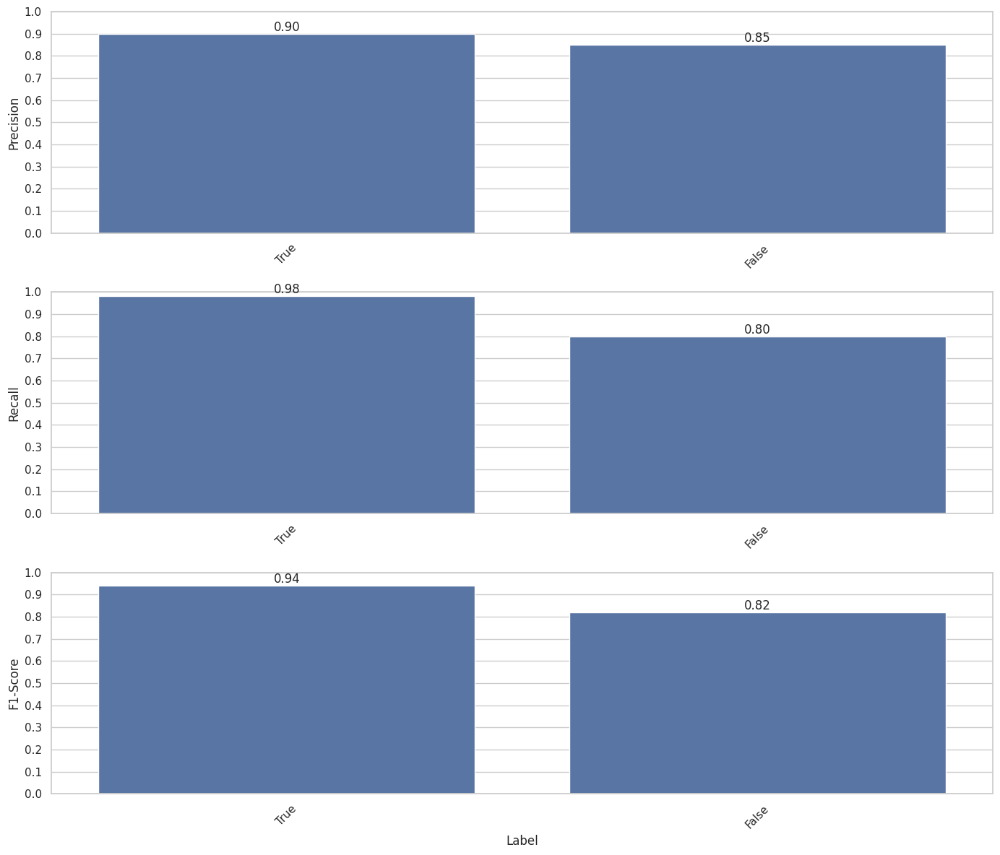

# Furniture Scraper

This project is a web scraper designed to extract all furniture products from various e-commerce websites. It uses a trained classification model from Hugging Face to accurately identify and extract the relevant product names.  

## Project Description

The classification model leverages pretrained BERT-base and adds one fuly connected classification layer on top of it with 2 labels(true and false).It is fine tuned on my data which I scraped from different related or non related sources(eg. furniture blogs or ikea website etc).  
The scraper leverages selenium and BeautifulSoup library.

## Considerations
1. The websites to crawl are in english 
2. Product names are allways isolated within commonhtml tags.
3. Due to the fact that the products are isolated, a classification model is preffered instead of a NER model.
4. The products extracted should be case insensitive

## Model 
Due to the fact that some websites may present products in lower case, I went for bert-base uncased for robustness.

Initially, I explored various recommendations for utilizing Named Entity Recognition (NER) from every possible angle. My first attempt involved creating an NER model designed to label product entities within a given page source. However, this approach performed poorly.For training purposes, I utilized pages randomly crawled from the list below, inserting products within them.  
For the latter method, I experimented with applying a NER model to every text node extracted from the page source.To train it, I inserted products into random HTML text tags from different eccomerce websites and businesses, labeling them as products with the IOB tagging scheme.  
This approach yielded improved results, but led me to conclude that, given we only have two possible entities (product and non-product), it is significantly more effective to employ a binary classification model and apply it to every text node in the page source.  

I've opted for a classification model approach primarily for its speed and its ability to leverage the HTML structure of a website for more accurate data extraction. By training the model to recognize patterns associated with furniture-related content from the html tags, we can efficiently filter out irrelevant data and focus on the extraction of valuable product information.  
The model was trained with TrainModel class from train_model.py file, freezing the layers and using hugging face BERT-base model for 25 epochs. 

For the positive labels I crawled the following websites:  
	1.IKEA(12788 samples)  
	2.EBAY(4057 samples)  
	3.FLIPKART(5605 samples)  
	4.FACTORYBUY(2215 samples)  
	5.Google Shopping(2200 samples)  
	5.Some smaller ones(6600 samples)  

I had a problem with the negative labels because the true negatives were related to furniture products(eg. product descriptions, instructions on how to mount, site descriptions etc).Therefore, the first model I trained had a really good precision but bad accuracy due to the false positives.    

The solution I found was to build a set of negative labels dataset containing 40% furniture related text and 60% english text from eccomerce businesses and websites.
To acomplish this, I crawled furniture blogs, mainly because they provide furniture related text that doesn't contain real products and some more random ecommerce websites generated with copilot.(22392 samples for blogs and 36659 for the rest)   
Training data is available for download at the links section below.

Here are the metrics of the model:  

## Scraper
For fetching the sources, I initially went with the requests module. However, many websites had annoying pop-ups and cookies that limited the scraper's effectiveness. Consequently, I opted for Selenium in headless mode to better manage these pop-ups, either by accepting or rejecting them.

The scraper from crawler.py uses selenium in headless mode coupled with Beautiful Soup library.	I've written a function to bypass any pop-up or accept any cookies button, because many urls don't return anything due to this problem.  
We are extracting all possible tags that can contain text, then we apply the model and then we sort the results in the descending orders of the probabilities. 
The crawl function has 3 argumets:
	urls, 
	threshold, -> (The threshold is used to extract the text which has a probability to be a product greater than it)
	threaded, -> (false for single threaded, tru for multi-threading)
	num_workers = None (How many working threads)

## Features

- Extracts all furniture products from a website  
- Uses a trained classification model for accurate information extraction  
- Can differentiate between product-related and non-product-related text  

## How to use
1. Install the dependencies from requirements.txt with 'pip install -r requirements.txt' 
2. Download the last checkpoint from the link below in a directory named 'checkpoint-76000'.  
3. run 'python3 run.py <file_with_urls>' 
4. (*Optional)To use the multi-threaded version go in crawler.py and call the crawl function with the number of workers you please.I reccomend to not use more that 5 threads and that if you have a powerful setup.This will speed up the process of crawling by (number of threads - 1) in general!    

'products_threaded.csv' was crawled multi_threaded and 'products.csv' single-threaded.As you can see they have same results

## Links for download

1. [Checkpoint-76000](https://www.dropbox.com/scl/fi/k7pcm3nab3thwf7w2jzef/checkpoint-76000.zip?rlkey=pm4h7jf52kusx67pf71cls38n&dl=0)
2. [Training data](https://www.dropbox.com/scl/fi/xdexlxgd3sx88k11692rj/training_data.zip?rlkey=e5b2mldouftl5kflk1zacuj9l&dl=0)

## License
Apache 2.0
